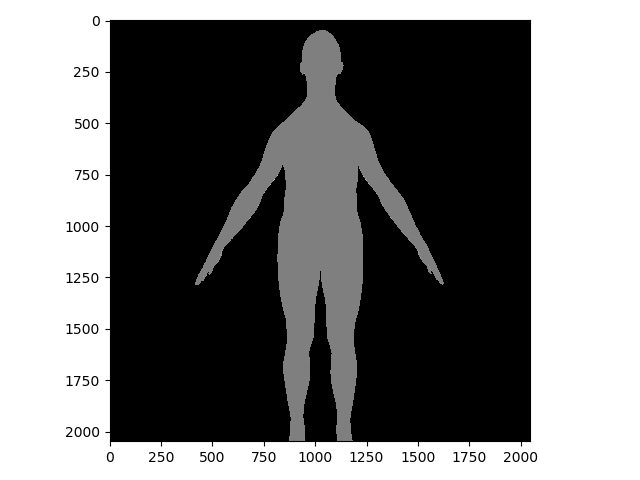
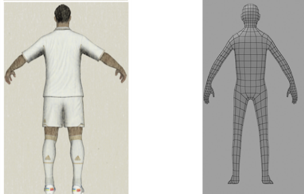
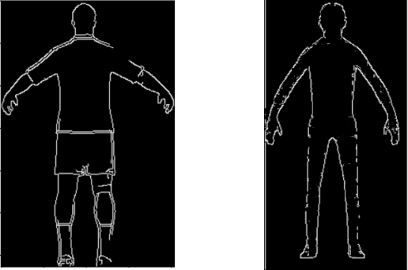

3D Anthropometric Measurement
Course Project- Practicum in Intelligent Information Systems 

SMPL Installation: 

1. `Activate virtual env`
2. `
git clone https://github.com/gulvarol/smplpytorch.git
`
3. `cd smplpytorch`
4. `pip install .

Pytorch 3D install
`pip install 'git+https://github.com/facebookresearch/pytorch3d.git'`

 
We aim to measure the standard human body parts like waist, shoulder etc required for tailoring of clothes using just the images of that person. The applications for this technique can be in online shopping for clothes or online ordering of clothes to be tailored. The standard method we have chosen to compare our results is the m-tailor app, which calculates the measurements using the phone camera. We try to fit meshes to the size of the person in order to get a 3D representation of him/her and finally measure the mesh for the required body parts.
  

With people shifting more towards online shopping, it is difficult for them to get a judgment of their own measurements in order to get the perfect size since measuring tapes might not be available in every household. Also, taking tens of measurements of different parts one by one is not the fastest and the most convenient way for it. Therefore we tried to build a system which would get the required measurements using just four input images of a person from four different angles- front, back and two sides to be more precise. For this we make the use of meshes for representing the person and deforming them until they capture the perfect size of that person. 
  
**Methodology:**

Mesh initialization: 
In our approach, the mesh of a person will be initialized using a generic human mesh, one for male and one for female. We have chosen the SMLP library for the initialization. The parameters have been chosen in such a way that the posture of mesh matches the most with the posture in the input image which in our case is standing straight with hands at around 30 degrees away from the body. This initial posture need not be exactly the same as input posture, but it makes the convergence of the model faster. The initialized mesh can be seen in figure 1.

 
Fig 1. SMPL mesh initialization for male mesh

Deformation: 
We take the projection of the mesh at each angle from which the input was provided. Each of this projection is compared to the input image and the difference between the projection and the input image becomes a loss metric for the backprop for deforming the mesh. The entire mesh is a trainable parameter and therefore the backprop will essentially deform the entire mesh.

We want to make sure that our loss function discriminates only on the basis of measurements and not on background or any other factor. Therefore we take the silhouette of both the images before comparing as shown in figure 2 and 3. Even now, it is not a trivial task to compare both these images only based on measurements. We train our own discriminator to use it as adversarial loss for this task. This network is a siamese network that passes the image through the same network and sees the euclidean distance between the outputs to check their similarities. We still need real (same) and fake (different) samples to train the network. For the fake samples, we can directly use the projected image and the input image as their sizes are different. For the real sample, we use the same mesh and take a projection of it from a slightly different angle (±5 degrees) to use these two projections as real samples. Finally this loss is backpropagation through the network to deform the mesh.

 
Fig 2. Comparing input image and projection of the mesh from the same angle

 
Fig 3. Comparing silhouette of both the previous images

Measurement: 
To take the final measurements from the mesh, we manually identified 3 points for each circular measurement, and two otherwise. We used a star to find the shortest distance between these points to get our final path to be measured. These measurements are in terms of the mesh distance. These can be converted to cm by multiplying the measurements by a factor of (height of person in cm / height of the mesh)

Dataset: 
Due to no available dataset meeting our requirements, we used the NOMO dataset which contains meshes of people and their measurements. We utilized the meshes to take projections from 4 angles to use as an input for our network. We do not utilize the measurements available in the dataset since we wanted to go for an unsupervised approach. We train for embeddings of the same size to get scaling factor for getting the final measurements in cm.
  
The human mesh is not meant to be deformed in any way. One way to restrict this deformation to particular planes is PCA. Also, since the dataset is a synthetic one, there would be many other problems in the real word dataset since the people would be wearing clothes in it which would make it difficult for the discriminator to differentiate only based on measurements. 
